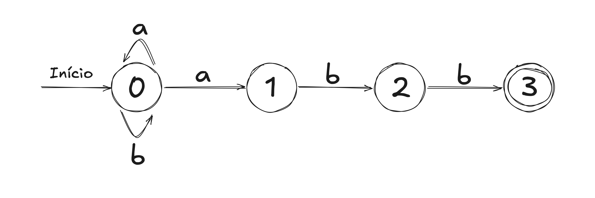

# Entendendo os NFAs (Autômatos Finitos Não Deterministas) Sem Dor de Cabeça

Você já ouviu falar de NFAs? Não? Bom, eles são basicamente uns robozinhos matemáticos que adoram ler strings e decidir se elas são "aceitáveis" ou não. Parece complicado? Relaxa, vou te explicar de forma simples (prometo que sem muito "tecniquês").

## O Que é um NFA?

Um **NFA**, ou Autômato Finito Não Determinista, é um modelo matemático que serve para resolver problemas de linguagens formais. Mas o que isso significa no mundo real? Pense nele como um detetive que analisa padrões em palavras ou frases. Por exemplo, você quer saber se uma palavra termina com "abb"? O NFA consegue descobrir isso para você.

### O Básico

Um NFA tem:

1. **Estados**: São os "lugares" por onde ele passa enquanto analisa a palavra.
2. **Alfabeto**: Os símbolos que ele entende, tipo "a" e "b".
3. **Transições**: Regras que dizem para onde ele vai baseado no símbolo que ele leu.
4. **Estado Inicial**: De onde ele começa.
5. **Estados Finais**: Os "destinos felizes". Se ele chegar aqui no final, ele aceita a palavra.

E o que faz um NFA ser especial? Ele pode escolher entre várias opções ao mesmo tempo! É como se ele dissesse: "Ah, vou testar todos os caminhos possíveis, e se um der certo, maravilha!"

---

## Como Funciona na Prática?

Imagine que você tem um NFA que quer descobrir se uma palavra termina com "abb". Ele funciona mais ou menos assim:

1. Começa no estado inicial.
2. Vai lendo a palavra, tipo "a", depois "b", depois "b".
3. Se ele seguir as transições certas e terminar no estado final, ele diz: **"Aceito!"**.

Aqui está o "mapa" dele:



Esse desenho é o grafo de transição do NFA. E o que significa? Bem:

- O estado inicial é 0
- O estado 3 é onde ele faz a dancinha da vitória (porque a palavra foi aceita).
- Ele aceita palavras como "abb", "aabb", ou "bababb".

## Programando um AFN em TypeScript

Agora, se você curte codar, dá para fazer um AFN em TypeScript. Aqui está o código:

```typescript
type State = number;
type Symbol = string;

class NFA {
  private transitions: Map<string, Set<State>>;
  private startState: State;
  private acceptStates: Set<State>;

  constructor(
    transitions: Map<string, Set<State>>,
    startState: State,
    acceptStates: Set<State>
  ) {
    this.transitions = transitions;
    this.startState = startState;
    this.acceptStates = acceptStates;
  }

  public accepts(input: string): boolean {
    let currentStates = new Set<State>([this.startState]);

    for (const symbol of input) {
      const nextStates = new Set<State>();

      for (const state of currentStates) {
        const key = `${state},${symbol}`;
        if (this.transitions.has(key)) {
          this.transitions.get(key)?.forEach((s) => nextStates.add(s));
        }
      }

      currentStates = nextStates;
    }

    return [...currentStates].some((state) => this.acceptStates.has(state));
  }
}

// Definição do NFA
const transitions = new Map<string, Set<State>>([
  ["0,a", new Set<State>([1])],
  ["0,b", new Set<State>([1])],
  ["1,b", new Set<State>([2])],
  ["2,b", new Set<State>([3])],
]);

const nfa = new NFA(transitions, 0, new Set<State>([3]));

// Testando
console.log(nfa.accepts("abb")); // true
console.log(nfa.accepts("aabb")); // true
console.log(nfa.accepts("abababb")); // true
console.log(nfa.accepts("ab")); // false
```

### O Que Está Rolando Aqui?

- A classe NFA basicamente simula o autômato.
- O método accepts pega uma string e segue as regras para ver se a palavra é aceita.
- As transições são como o GPS do NFA, mostrando para onde ele pode ir.

E pronto! Com esse código, você pode testar suas palavras e ver se o NFA go
sta delas ou não.

### Por Que Isso é Legal?

Além de parecer mágica, NFAs são super úteis! Eles estão por trás de ferramentas como analisadores de código, expressões regulares e até mecanismos de busca. Então, mesmo que pareça algo super teórico, eles estão por todo lado no mundo real.

**Referência:**

AHO, Alfred V.; LAM, Monica S.; SETHI, Ravi; ULLMAN, Jeffrey D. **Compiladores: Princípios, Técnicas e Ferramentas**. 2. ed. São Paulo: Pearson Addison Wesley, 2008. p. 106.
